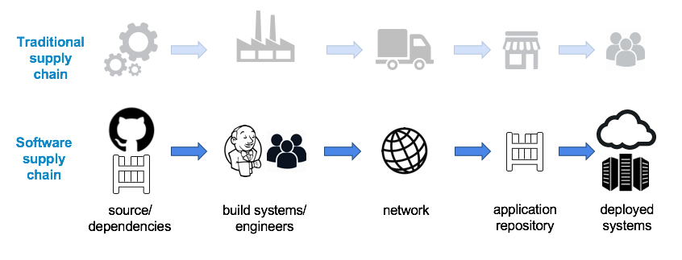
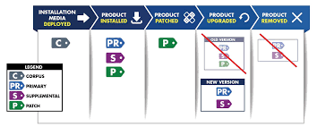

## Introduction

Before going through Software BOMs, we need to set the ground for a rising concern in the software industry which is Software Supply Chain Security.
Like traditional industries, deploying a piece of a software artifact goes through multiple stages composed of collecting source code components, libraries, tools, and processes used in those stages.


A supply chain attack can occur along the chain from submitting unauthorized malicious code in your source, injecting harmful dependencies with backdoor ways to your authentication system, and even replacing packages after being built with other compromised artifacts.
A more detailed explanation about those types of attacks is [here](https://slsa.dev/spec/v0.1/threats)

Due to its importance and being a critical issue, Generating SBOM for your software adds another layer of protection to this threat.

## Definition: What is SBOM?

As far as we know, developers around the world are building web applications using hundreds of third-party open-source libraries and packages. You can confidentially tell that 90% of the software products around the world are built over open-source components. With that in mind, we need to keep track of using these dependencies while building our applications. What if there are vulnerabilities in the libraries we use? How to efficiently protect ourselves against it?.

**[Software Bill Of Materials](https://en.wikipedia.org/wiki/Software_supply_chain#:~:text=Software%20vendors%20often,could%20harm%20them.)** (SBOM) is a complete formally structured list of the materials (components, packages, libraries, SDK) used to build (i.e. compile, link) a given piece of software and the supply chain relationships between all these materials.

It is an inventory of all the components developers used to make this software. It has many formats and many generating tools but all have the same purpose in the end.
***Example: a simply formatted SBOM of Ubuntu alpine docker image using [syft](https://anchore.com/sbom/how-to-generate-an-sbom-with-free-open-source-tools/)***

```
✔ Loaded image  
 ✔ Parsed image  
 ✔ Cataloged packages      [14 packages]
NAME                    VERSION      TYPE 
alpine-baselayout       3.2.0-r18    apk   
alpine-keys             2.4-r1       apk   
apk-tools               2.12.7-r3    apk   
busybox                 1.34.1-r3    apk   
ca-certificates-bundle  20191127-r7  apk   
libc-utils              0.7.2-r3     apk   
libcrypto1.1            1.1.1l-r7    apk   
libretls                3.3.4-r2     apk   
libssl1.1               1.1.1l-r7    apk   
musl                    1.2.2-r7     apk   
musl-utils              1.2.2-r7     apk   
scanelf                 1.3.3-r0     apk   
ssl_client              1.34.1-r3    apk   
zlib                    1.2.11-r3    apk

```

Here it shows only softwares included in the final layer of the container (default choice by syft). If we want to view a detailed SBOM with one detailed format, we can run `syft alpine -o spdx-json`. This will view the output as `.json` file following the `spdx` format (will discuss that later)

## Use cases in Supply chain security

What makes a supply chain attack susceptible is the lack of transparency and visibility about whether the software gets affected by a recent exploit or not. This greatly affects both developers and users of the product.

On the user's side if they know the components of the software and that there is one component affected by certain vulnerabilities, they are better aware and ready to protect against potential attacks. This is crucial in many cases, especially with open-source tools.

On the developer's side, it happens alot that developers aren't fully aware of all third parties used inside the project, and in turn, they can not track vulnerabilities in the system that could pose a threat. Cases like the [Log4Shell](https://snyk.io/blog/log4shell-in-a-nutshell/) vulnerability are an example of a component (in this case, a logging library) that many developers never bother to check because it isn't a direct software dependency, but rather a transitive one that is depended upon by other components.

SBOM can be useful in licensing and legal issues with some formats. SPDX standard for SBOM identifies the licenses of the used components and can be checked for compliance later.

## Different SBOM formats comparison

The National Telecommunications and Information Administration (NTIA) in the U.S. defined minimum requirements for SBOM formats:

* Identifying the supplier of the software component.
* Identifying the details about the version of the component.
* Including unique identifiers for the component like cryptographic hash functions.
* Including the relationships between all dependencies inside the component.
* Including a timestamp of when and by whom the SBOM report was created or last modified

 In this section, we discuss different kinds and formats for SBOM standards and make a brief comparison between them. Three commonly used standards achieved the NTIA minimum requirements for SBOM generation and each one results in a different final SBOM document.

### 1 - The Software Package Data Exchange (SPDX)

***History:***

 The first one is an open-source machine-readable format adopted by the Linux Foundation as an industry standard. The specifications are implemented as a file format that identifies the software components within a larger piece of computer software and fulfilling the requirements of NTIA. The SPDX project started in 2010 and was initially dedicated to solving the issues around open source licensing compliance. It evolved over the years to adhere supply chain security challenges and has seen extensive uptake by companies and projects in the software industry. Companies like Hitachi, Fujitsu, and Toshiba contributed to furthering the standard in the [SPDX v2.2.2 specification release](https://spdx.github.io/spdx-spec/).

***Specs:***

 The [SPDX specification](https://spdx.github.io/spdx-spec/) describes the necessary sections and fields to produce a valid SPDX document. Note that the only mandatory field in all spdx documents is the "Document Creation Information" section. The presence of other sections (and subset fields of each section) is dependent on your use case and the information you want to provide.


* **Document Creation Information** – Denotes who created the document, how it was created, and other useful information related to its creation. It provides the necessary information for forward and backward compatibility for processing tools (version numbers, license for data, authors, etc. )
* **Package Information** – This section provides information about the “package”. A package can be one or more files. These files could be one or more files of any type including but not limited to source, documents, binaries, containers, and so forth. The package information contains the originator, where it was sourced from, a download URL, a checksum, and so forth. It also contains summary licensing for the package.
* **File Information** –  This is information about a specific file. It can contain the file copyrights found in the file (if any), the license of the file, a checksum for the file, file contributors, and so forth.
* **Snippet Information** – Snippets can optionally be used when a file is known to have some content that has been included from another source. They are useful for denoting when part of a file may have been created under another licenseSnippet information can be used to define licensing for ranges within files.
* **Other Licensing Information** – Other licensing information provides a way to describe licenses that are not on the [SPDX License List](https://spdx.org/licenses/). You can create a local (to the SPDX document) identifier for the license and place the license text itself in the document as a well and then reference it for files just like you would a license from the license list.
* **Relationships** –  Relationships were introduced in the 2.0 specification and are a very powerful way of expressing how SPDX documents relate to one another. See an example of how the SPDX represents those [here](https://spdx.dev/resources/use/#:~:text=Packages%20and%20Relationships).
* **Annotations** – Annotations are comments made by people on various entities and elements within the document. For example, someone reviewing the document may make an annotation about a file and its license. Annotations are useful for reviews of SPDX documents and for conveying specific information about the package, file, creation, license, file(s), etc.

In the [SPDX specification release 2.2.2](https://spdx.github.io/spdx-spec/), additional output formats of JSON, YAML, and XML are supported. A diverse set of examples for SPDX are available on this [github repo](https://github.com/spdx/spdx-examples)

Further information on the data model and SPDX guide can be found on the [SPDX website](https://spdx.dev/).

---

***Use Cases:***

* SBOM for software components
* Tracking of intellectual property (licensing, copyright) of software components
* Listing contents of a software distribution
* Container contents inventory
* Associating CPEs with specific packages
* Identifying provenance of lines of code embedded in files

***Key Features:***

* Documented artifacts can be checked using the provided hash values
* Rich facilities for intellectual property and licensing information
* Flexible model able to scale from snippets and files up to packages, containers, and even operating system distributions
* Ability to add mappings to other package reference systems

### 2 - Software Identification (SWID) Tags:

***History:***

 It is a standard implemented by the National Institute of Standards and Technology (NIST) in the U.S. that was published in 2009, then revised in 2015. They were designed to provide a transparent way for organizations to track the software installed on their managed devices. Standard SWID tags are not generated at the end of certain software creation, instead, they define a lifecycle where a new SWID tag is added to an endpoint with the software installation process and is deleted with the uninstall process. When this lifecycle is followed, the presence of a given SWID Tag corresponds directly to the presence of the software product that the Tag describes.

 

Note that the present SWID tags change depending on the current state of the software.

***Specs:***

The [NISTIR 8060](https://nvlpubs.nist.gov/nistpubs/ir/2016/NIST.IR.8060.pdf) Guideline identifies the standards of SWID tags and the components of each tag. We here go over the necessary types mentioned in the figure above. To capture the lifecycle of a software component, the SWID specification defines four types of SWID tags: primary, patch, corpus, and supplemental

* **Corpus Tag** –  A SWID Tag that identifies and describes an installable software product in its pre-installation state. A corpus tag can be used to represent metadata about an
  installation package or installer for a software product, a software update, or a patch.
* **Primary Tag** –  A SWID Tag that identifies and describes a software product installed
  on a computing device.
* **Supplemental Tag** – A SWID Tag that allows additional information to be associated with any referenced SWID tag. This helps to ensure that SWID Primary and Patch Tags
  provided by a software provider are not modified by software management tools while
  allowing these tools to provide their software metadata.
* **Patch Information** – A SWID Tag that identifies and describes an installed patch that has made incremental changes to a software product installed on a computing device.

**Note** that Corpus, primary, and patch tags have similar functions in that they describe the existence and/or presence of different types of software (e.g., software installers, software installations, software patches), and, potentially, different states of software products. In contrast, supplemental tags furnish additional information not contained in the corpus, primary, or patch tags.

SWID tags are mainly implemented in XML format while JSON format is under development. Some tag examples can be found [here](https://www.adelton.com/docs/security/minting-collecting-swid-tags)

***Use Cases:***

* SBOM for software components
* Continuous monitoring of installed software inventory
* Identifying vulnerable software on endpoints
* Ensuring that installed software is properly patched
* Preventing installation of unauthorized or corrupted software
* Preventing the execution of corrupted software
* Managing software entitlements

***Key Features:***

* Provides stable software identifiers created at build time
* Standardizes software information that can be exchanged between software providers and consumers as part of the software installation process
* Enables the correlation of information related to software including related patches or updates, configuration settings, security policies, and vulnerability and threat advisories.

### 3 - CycloneDX:

***History:***

 CycloneDX is a lightweight SBOM standard designed for use in application security context and supply chain component analysis as it was originally intended to identify vulnerabilities and supply chain component analysis. It also supports checking for licensing compliance. The CycloneDX project was initiated in 2017 in the [OWASP ](https://owasp.org/)community, then it became a dedicated open source project and included other working groups from [Sonatype ](https://www.sonatype.com/)and [ServiceNow](https://www.servicenow.com/). Supported file formats for CycloneDX are (XML, JSON, and protocol buffers)

***Specs:***

 CycloneDX provides schemas for both XML and JSON, defining a format for describing simple and complex compositions of software components. It's designed to be flexible, and easily adaptable, with implementations for popular build systems. The specification encourages the use of ecosystem-native naming conventions and supports SPDX license IDs and expressions, pedigree, and external references. It also natively supports the Package URL specification and correlating components to CPEs. The CycloneDX object model is defined in the figure.


* **BOM Metadata Information** – BOM metadata includes the supplier, manufacturer, and the target component for which the BOM describes. It also includes the tools used to create the BOM, and license information for the BOM document itself.
* **Components Information** – Components describe the complete inventory of first-party and third-party components. Component identity can be represented as:
  -- Coordinates (group, name, version)
  -- Package URL
  -- Common Platform Enumerations (CPE)
  -- SWID
  -- Cryptographic hash functions (SHA-1, SHA-2, SHA-3, BLAKE2b, BLAKE3)
* **Services Information** – Services describe external APIs that the software may call. Services describe endpoint URIs, authentication requirements, and trust boundary traversals. The flow of data between software and services can also be described including the data classifications and the flow direction of each type.
* **Dependency Relationships** – CycloneDX provides the ability to describe components and their dependency on other components. The dependency graph is capable of representing both direct and transitive relationships. Components that depend on services can be represented in the dependency graph and services that depend on other services can be represented as well.
* **Compositions** – Compositions describe constituent parts (including components, services, and dependency relationships) and their completeness. The aggregate of each composition can be described as complete, incomplete, incomplete first-party only, incomplete third-party only, or unknown.
* **Vulnerabilities** –  Known vulnerabilities inherited from the use of third-party and open source software and the exploitability of the vulnerabilities can be communicated with CycloneDX. Previously unknown vulnerabilities affecting both components and services may also be disclosed using CycloneDX, making it ideal for both VEX and security advisory use cases.
* **Extensions** – Multiple extension points exist throughout the CycloneDX object model allowing fast prototyping of new capabilities and support for specialized and future use cases. The CycloneDX project maintains extensions that are beneficial to the larger community. The project encourages community participation and the development of extensions that target specialized or industry-specific use cases.

***Use Cases:***

* Inventory of all software components.
* Identifying known vulnerabilities.
* Integrity verification using the hash functions.
* Authenticity of the software components using a digital signature.
* License compliance
* Provenance

## Different SBOM generation tools comparison

If you got this far, you already realize the importance of SBOM generation, and also it should meet certain requirements to achieve its purpose. Due to various requirements depending on what standard you're following, there has to be a way to automatically generate different output formats for different standards. Also, it has to be suited for ci/cd solutions to keep up with the increasing number of releases for each organization.

Note: Here we're only considering open source tools

### 1 - Anchore Syft

***Introduction:***

[Anchore ](https://anchore.com/)is a platform that implements sbom-powered supply chain security solutions for developers and enterprises. For generating SBOMs, a CLI tool and library named [Syft](https://github.com/anchore/syft) was developed by Anchore that could be injected into your ci/cd pipeline to generate SBOMs from container images and filesystems at each step.

***Integration and Support:***

Syft is supported on Linux, Mac, and Windows and it can run as a docker container which makes it a great suit for CI systems. Other than the 3 SBOM standards, Syft can generate its JSON standard format to be input for other Anchore tools like [Grype](https://github.com/anchore/grype/) which is a vulnerability scanner for container images and filesystems. It supports projects based on the following package managers:

* Alpine (apk)
* C (conan)
* C++ (conan)
* Dart (pubs)
* Debian (dpkg)
* Dotnet (deps.json)
* Objective-C (cocoapods)
* Go (go.mod, Go binaries)
* Haskell (cabal, stack)
* Java (jar, ear, war, par, sar)
* JavaScript (npm, yarn)
* Jenkins Plugins (jpi, hpi)
* PHP (composer)
* Python (wheel, egg, poetry, requirements.txt)
* Red Hat (rpm)
* Ruby (gem)
* Rust (cargo.lock)
* Swift (cocoapods)

***Features and Specs:***

* Easy to use
  * Syft can generate a simple basic sbom by just running `syft <image>` this will only include the softwares included in the image's final layer. Or `syft <image> --scope all-layers` for more verbose sbom to include all image layers
* Different formats support the ability to convert between them.
  * Syft JSON
  * SPDX 2.2 JSON
  * SPDX 2.2 tag-value
  * CycloneDX 1.4 JSON
  * CycloneDX 1.4 XML
* Cryptographically sign and attest SBOMs
  * Syft uses [in-toto attestations](https://github.com/in-toto/attestation) with `syft attest` command and the digital signature management is integrated with sigstore cosign. You can view more [here](https://anchore.com/sbom/creating-sbom-attestations-using-syft-and-sigstore/).
* Support a variety of sources to generate SBOMs from
  * OCI and docker image formats `syft <image>`
  * Container images archives `syft path/to/image.tar`
  * Filesystems and local directories `syft path/to/dir`

For more resources about Syft capabilities refer to the [source repo](https://github.com/anchore/syft) and [official documentation](https://anchore.com/sbom/how-to-generate-an-sbom-with-free-open-source-tools/)

### 2- Opensbom's Spdx-Sbom-Generator

***Introduction:***

[Opensbom-Generator](https://github.com/opensbom-generator) is an open source project initiated by the Linux Foundation SPDX workgroup to generate SBOMs using CLI tools. Currently, they support the standard spdx 2.2 formats and JSON with their [spdx-sbom-generator](https://github.com/opensbom-generator/spdx-sbom-generator) tool based on golang. It can only be used to generate SBOMs from a repository containing package files (no container images or archives support yet). They aim to provide SBOM generation support in ci/cd solutions.

***Integration and Support:***

You can download the binaries and install the tool on your system. The available binaries to install are for Linux, Windows, and macOS and it can also be used as a docker container from this spdx [repo](https://hub.docker.com/r/spdx/spdx-sbom-generator). It can detect which package managers or build systems are being used by the software. It is supporting the following package managers:

`GoMod (go), Cargo (Rust), Composer (PHP), DotNet (.NET), Maven (Java), NPM (Node.js), Yarn (Node.js), PIP (Python), Pipenv (Python), Gems (Ruby), Swift Package Manager (Swift)`

***Features and Specs:***

* CLI easy to use and simple interface
* Automatic detection of the package manager

### 3- Kubernetes BOM

***Introduction:***

[BOM](https://github.com/kubernetes-sigs/bom) is a general-purpose CLI tool developed by [kubernetes-sigs](https://github.com/kubernetes-sigs) (Special Interest Groups) that can generate SBOMs from directories, container images, single files, and other sources. The utility has a built-in license classifier that can check for license compliance of your packages with around 400+ licenses in the [SPDX catalog.](https://spdx.org/licenses/)

***Integration and Support:***

BOM is supported as a Golang package that can be installed on any system having to go with `go install sigs.k8s.io/bom/cmd/bom` this adds the support for Linux, Mac, and Windows. It is compatible with creating SBOMs from files, images, and docker archives (images in tarballs). It also supports pulling images from remote container registries for analysis. BOM is mainly generating SBOMs in SPDX formats.

***Features and Specs:***

* CLI usage to support CI/CD solutions
* Golang dependency analysis
* Full `.gitignore` support when scanning git repositories
* Ability to check for license compliance with SPDX catalog
* Support for different sources to generate sboms
* Other than the command `bom generate`, it uses `bom document` to work with already present SPDX documents to outline and draw a structure for them
* It doesn't necessarily require a whole project directory but it can specify a single file to analyze with the `-f path/to/file` flag and it can have a collection of those files to be analyzed together.
* It also supports the namespacing separation between SBOM documents using the `-n <URI>` flag to isolate each document from the other

### 4- Microsoft SBOM tool

***Introduction:***

Recently, Microsoft open-sourced their SBOM generation tool which is described as a general purpose, enterprise-proven, build-time SBOM generator. They have been developing the tool internally since 2019 and tuning its feature according to their needs and providing other companies with the solution. What is new is that Microsoft has chosen to merge efforts with the Linux Foundation's work and use [Software Package Data Exchange (SPDX)](https://spdx.dev/) for all SBOMs generated, and to do this for all software produced. It has a promising number of features like including other SBOM documents recursively to provide its users with the ability to have a full dependency tree that goes to the origin of every package.

***Integration and Support:***

Microsoft SBOM is supported on Linux, macOS, and Windows. It can be easily integrated into and auto-detects the following package managers

`NPM, NuGet, PyPI, CocoaPods, Maven, Golang, Rust Crates, RubyGems, Linux packages within containers, Gradle, Ivy, GitHub public repositories`

and Microsoft is adding more detectors to improve deeper integration with the community. The tool is currently committed to generating the SPDX 2.2.1 format for its users and is still in development to include all optional fields before integrating with other formats.

***Features and Specs:***

* Enterprise ready and highly scalable as already used at scale by Microsoft
* Adding build provenance information to the SBOM
* Auto-detection of the underlying package manager
* Supports namespacing separation between SBOM documents with the `-nsb` flag
* Validating SBOMs at release using hashes and digital signatures
  

For more information about the tool visit the GitHub [repo ](https://github.com/microsoft/sbom-tool)and refer to the documentation [here](https://github.com/microsoft/sbom-tool/tree/main/docs)

### 5- Tern

***Introduction:***

[Tern](https://github.com/tern-tools/tern) is a VMware-originated open source inspection tool used to generate SBOMs following standard formats. It gathers metadata for the packages installed in container images and Dockerfiles. Tern starts to analyze the contents of a container (through the image itself or the Dockerfile), layer by layer, without requiring the user to have in-depth technical knowledge about how the container was built.

***Integration and Support:***

Tern itself is available as a [Github Action](https://github.com/marketplace/actions/tern-action) but it is mainly supported to be installed as a CLI tool on Linux. With Linux installation, Tern is built with python so it requires python, pip, and jq installed mainly (more about installation [here](https://github.com/tern-tools/tern#getting-started)). Some features like analyzing Dockerfiles and the [lock function](https://automatecompliance.org/news/2020/04/23/tern-2-0-0-now-available/) require Docker installation in your Linux. Moreover, Tern can run as a docker container which makes it easy to use in ci systems and can be used as a workaround to run on other operating systems like Windows, and macOS. Also, this helps to deploy Tern as a Kubernetes job with a host mount to retrieve generated SBOMs.

For now, Tern only supports container images built using Docker using [image manifest version 2, schema 2](https://docs.docker.com/registry/spec/manifest-v2-2/) and it will support Docker images and it is aimed to support other images that follow the OCI standards in the future.

For license compliance, Term doesn't have its file-level license analyzer. So, it allows you to extend its analysis using an external CLI tool or Python packages as extensions. An example is [Scancode](https://github.com/tern-tools/tern#scancode) which is a CLI tool used for license compliance along with other supported integrations like [cve-bin-tool](https://github.com/tern-tools/tern#cve-bin-tool) for vulnerability scanning.

Tern supports generating reports with multiple formats:

* Human Readable Simple format
* JSON format
* HTML format
* YAML format
* SPDX tag-value Format
* SPDX JSON Format
* CycloneDX JSON Format

***Features and Specs:***

* CLI is easy to use and can be installed as a docker container which makes it suitable for CI/CD solutions
* Multiple supported output formats which are readable for both humans and machines
* Ability to generate SBOMs following both SPDX and CycloneDX formats
* Support for Dockerfile locking to create more reproducible Docker images which is a unique feature supported by Tern only, view more about it [here](https://automatecompliance.org/news/2020/04/23/tern-2-0-0-now-available/).
* The concept of extensions/plugins is only supported by Tern between all the previously mentioned tools. This is a great feature that is proven to extend its capabilities in the coming future and open for creativity from the open source community (this was proven before to increase the functionality and popularity of other tools like Jenkins).

For more information about the tool visit the GitHub [repo](https://github.com/tern-tools/tern) and refer to the documentation [here](https://github.com/tern-tools/tern/tree/main/docs).
