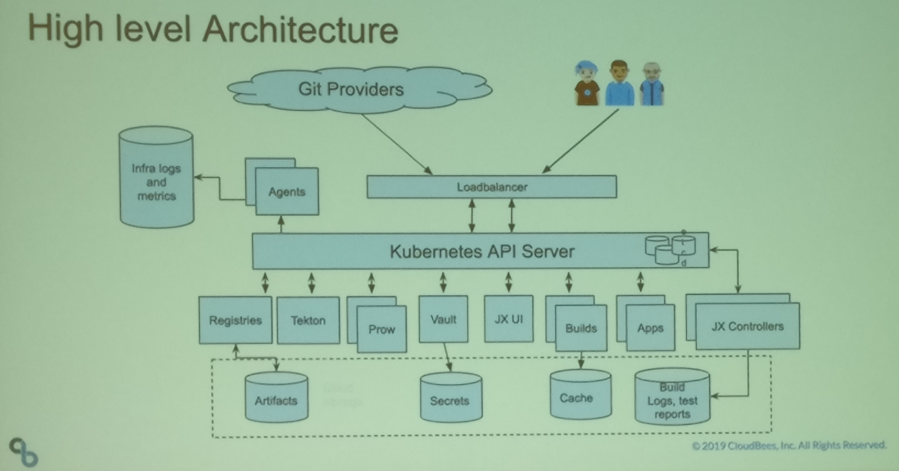

Jenkins X was the star of the show at DevOps World | Jenkins World 2019. In this article I will 
share with you the dozen key things I learned about this exciting new cloud native CI/CD tool.
Even if you never use it for CI/CD, Jenkins X provides an excellent example of how to architect 
a cloud native application on Kubernetes.

If you need help with this kind of stuff, I'm looking for a new opportunity--connect with me at
[@johnmcgehee](https://twitter.com/johnmcgehee) or jenkins-x@johnnado.com.

## Tekton

[Vic Iglesias](https://twitter.com/vicnastea), Cloud Solutions Architect at Google presented the 
technical details of Tekton.
[Tekton](https://github.com/tektoncd) is an open API spec for describing CI/CD pipelines on 
Kubernetes. Kubernetes is the portable, open-source container orchestration system. Tekton grew 
out of Knative build. The goals of Tekton are:

*   Make CI/CD pipelines composable across the organization
*   Declarative
*   Reproducible
*   Cloud native: a stateless infrastructure that easily scales out

Tekton is an API spec and implementation, not a finished CI/CD tool. Jenkins X is the most 
prominent tool based on Tekton.

Tekton also has some useful subprojects:

* [Tekton dashboard](https://github.com/tektoncd/dashboard) helps you visualize what is going 
  on when you start out, but it is not a full featured Jenkins-style UI
* The [Tekton catalog](https://github.com/tektoncd/catalog) contains various reusable Tekton
  _Tasks_. This is your opportunity to contribute to Tekton.

### The future of Tekton

The Tekton near term roadmap calls for:

* Event triggering
* Log uploading
* SCM support

Longer term:

* Pause and resume
* partial execution
* Access control
* Configuration as code
* Notifications

Find out how to get involved at the [Tekton Community project on GitHub](https://github.com/tektoncd/community).

## Jenkins X

Jenkins X is a completely new CI/CD system that shares little but its name with the existing Jenkins. Jenkins X incorporates the best practices from the _State of DevOps_ reports and the seminal book, _Accelerate_ by [Nicole Forsgren](https://twitter.com/nicolefv), [Jez Humble](https://twitter.com/jezhumble) and [Gene Kim](https://twitter.com/RealGeneKim).


I attended multiple presentations by [James Strachan](https://twitter.com/jstrachan), Andrew Bayer and [James Rawlings](https://twitter.com/jdrawlings) of CloudBees, and [Mauricio Salatino](https://twitter.com/salaboy). Mr. Rawlings even gave two presentations. Each presentation covered Jenkins X from a different view, so here I compose everything into a unified summary.



## Setting up Kubernetes

[Terraform is recommended](https://cb-technologists.github.io/posts/gitops-series-part-1/) for 
setting up the required Kubernetes cluster and storage buckets. As explained below, you can also 
run jx boot from within Terraform.

By default, Terraform stores its state in local file `terraform.tfstate`. In an ephemeral cloud 
environment, this state gets lost and you would create a new cluster each time you applied 
Terraform. Remedy this by specifying a [Terraform backend](https://www.terraform.io/docs/
backends/index.html) to store the state in more durable storage like Google Cloud Storage or 
Amazon S3.

Presenters recommended nginx as an ingress controller and
[cert-manager](https://cb-technologists.github.io/posts/gitops-series-part-1/) to manage TLS 
(HTTPS SSL) certificates.

[VMWare's Octant UI tool](https://github.com/vmware/octant) enables introspection, navigation 
and object mahagement of your Kubernetes cluster. It runs on your local client just like 
`kubectl`. An advantage of Octant is that it authenticates the same way as `kubectl`: if `kubectl` works, octant works.

## Setting up Jenkins X

For a stable build of Jenkins X, get the
[CloudBees Jenkins X Distribution](https://www.cloudbees.com/products/cloudbees-jenkins-x-distribution).

Jenkins X has two modes:

* Static traditional Jenkins master with Jenkins pipelines. Use this if you want to continue 
  using your existing Jenkinsfiles.
* Jenkins X pipelines based on [Tekton pipelines](https://github.com/tektoncd/pipeline).
  This is now the default, and is recommended for the long term. This mode is controlled by
  the new `jenkins-x.yml` file, whose syntax resembles the Jenkinsfile declarative pipeline
  syntax.

There are two interactive quick start commands. The older and presumably more reliable is:
```
jx create quickstart
```

The newest command to install, configure and upgrade Jenkins X is:
```
jx boot
```

`jx boot` interactively queries the user for the required setup data, recording the responses in file `jx-requirements.yml`. It is re-entrant so you can run it repeatedly. Running `jx boot` from within Terraform is a useful technique.

Jenkins X evolves quickly, so `jx boot` records the Jenkinx X version to use in field 
`versionStream` within `jx-requirements.yml`. This establishes the version to use on subsequent 
invocations of `jx boot`. Update `versionStream` when you want to start using a newer version.

## Getting status

Get logs using:
```
jx get build logs
```

Track execution with:
```
jx get activity
```

List preview environments using:
```
jx get environments
```

## Basic concepts in Jenkins X pipelines

At this point a little vocabulary lession is in order.

### Step

A step is a command that runs in a separate container, sharing a workspace with other steps. Once a step fails, subsequent steps will not run. Step names must be unique within a stage. There is also a loop step, which runs the same command for each value in a list.

All the usual Kubernetes container configuration of resources, limits, volume mounts and so on are available to steps.

### Stage

A stage is a unit of work in a pipeline. A step contains either steps or nested stages. Each stage with steps runs in its own pod. The workspace is copied from one stage's pod to the next.

### Pipeline

There are two types of pipelines:

* Release pipelines merge into master, create a release and trigger promotion
* As the name implies, pull request pipelines are used to create a merge request preview environment

A pipeline is controlled by a `jenkins-x.yml` file at the top of the source control repository.

### Meta pipeline

Jenkins X has a bootstrapping problem: how to create a pipeline? The meta pipeline creates the real pipeline, sort of like Maven `release:prepare`.

## Defining pipelines

There are three ways to define a Jenkins X pipeline:

* Automatically via a build pack. The build pacl automatically detects the source code language.
* Specify a build pack and then override portions in `jenkins-x.yml`
* Fully define an entirely new pipeline in `jenkins-x.yml`. This is only useful for a pipeline 
  that will not be reused. Define a reusable pipeline as a build pack.

Build packs are standard, opinionated pipelines for languages. They consist of a predefined 
sequence of steps, run in a consistent order. They are similar to stages in that they can be 
overridden and extended.

Jenkins X is controlled by a `jenkins-x.yml` file that lives at the root of the Git repository. 
In `jenkins-x.yml`, you can:

* Override build packs
* Run steps before existing step using setup
* Use `type: replace` to replace a step
* To add a step to the end of the stage, leave the step name unspecified
* To apply an override to all pipelines, leave the pipeline name unspecified
* Modify container configuration or environment variables. Override environment variables
  using the same syntax as Kubernetes.

You can also define a completely new pipeline in `jenkins-x.yml`, but this is useful chiefly for debugging and testing. Create a reusable pipeline as a build pack.

### Default pipeline

Pull request and release pipelines are often very similar, so define a default for both.

## Syntax validation and IDE autocomplete

Check your pipelines using:
```
jx step syntax validate
```

Pipelines are usually defined by multiple YAML files. See how they fit together into one pipeline using:
```
jx step syntax effective
```

The Jenkins X YAML schema is available on schemastore.org, where amazingly IntelliJ and the VS Code YAML Language Extension pick it up automatically.

## GitOps, Prow and Lighthouse

GitOps is at the core of Jenkins X. GitOps extends Infrastructure as code by using pull requests to manage infrastructure changes. These pull requests might be created by developers, or they might be generated automatically by tooling.

Accordingly, Jenkins X creates a preview environment for each run of a pull request pipeline.

Jenkins X currently uses Prow as a webhook handler and ChatOps engine for pull requests. Importantly, **at this time Prow supports only GitHub.**

Since Jenkins X uses only a small portion of Prow, and since Prow supports only GitHub, the 
Jenkins X team is developing [Lighthouse](https://github.com/jenkins-x/lighthouse) as a 
lightweight replacement. In this very experimental webhook handler, the Git provider is factored 
out so that new providers can be easily added.

As an aside, adding a [new Git provider for Lighthouse](https://github.com/jenkins-x/go-scm) would be an excellent way to learn the Go language.

## Avoiding committing secrets

It can be difficult to avoid commiting secrets to Git. Thus separate file `parameters.yml` contains URL references to a secret. Also, Jenkins X runs Helm in a temporary directory.

The Helm chart `values.yml` files are separated into individual `values.tmpl.yml` files. These are templates so you can easily add secrets to them.

## HTTPS for preview environments

It is difficult to get HTTPS to work in preview environments because each preview environment gets a different URL. James Rawlings demonstrated the solution:

1. Specify that you want to use DNS for HTTPS in jx boot. This will cause [external-dns](https://github.com/kubernetes-incubator/external-dns) to be installed automatically.
2. Add `externalDNS` in `requirements.yml`:
   ```
   ingress:
     externalDNS: true
   ```
3. Then, create the domain (this example assumes you are using GKE):
   ```
   jx create domain gke --domain rawlingsdemo.co.uk
   ```
4. Finally, go to your domain registrar and replace their name servers with Google's name servers

### Using Jenkins X in multiple clusters

Strictly speaking, Jenkins X does not require its own cluster, but things work out better operationally if you use separate clusters for testing, staging and production.

On the development cluster, install Jenkins X. Install the Jenkins X [environment controller](https://github.com/jenkins-x-charts/environment-controller) on staging and production clusters. This is further explained in the article [Multiple Clusters](https://jenkins-x.io/getting-started/multi-cluster/).

## Upcoming Jenkins X features

Jenkins X is rapidly evolving. Upcoming features are:

* Conditional execution of stages
* Jenkins X apps to inject steps and stages
* More advanced config of stage pods
* More advanced solution for pipeline and stage sharing across repos

## How to learn Jenkins X

Many fine examples with source code on GitHub were presented:

* Mauricio Salatino presented what was by far
  [the most extensive example](https://salaboy.com/2019/08/12/building-cloud-native-platforms-with-jenkins-x/).
  Starting with a monolithic application, he decomposed it into microservices, built it with
  Jenkins X and deployed it on Kubernetes.
* For instruction on how to use Kubernetes itself, Mauricio recommends
  [learnk8s.io](https://learnk8s.io/academy/).
* Kurt Madel's CloudBees Technologists Group gave
  [several lightning talks](https://cb-technologists.github.io/posts/lightning-talks-dw-jw-2019/)
  that discuss Jenkins X.
  [GitOps for Jenkins Infrastructure](https://cb-technologists.github.io/posts/gitops-series-part-1/)
  contained great Terraform tips for regular Jenkins (not Jenkins X). Whether or not you really
  want to use GitOps for your blog,
  [GitOps for Blogging, Why Not?](https://github.com/cb-technologists/blog)
  demonstrates a nice GitOps example.

## Get involved with the Jenkins Community

Multiple presenters recommended the [Jenkins X slack channels](https://jenkins-x.io/community/) as the best source of help and information. For more ways to get involved, see the [Jenkins X community page](https://jenkins-x.io/community/).
